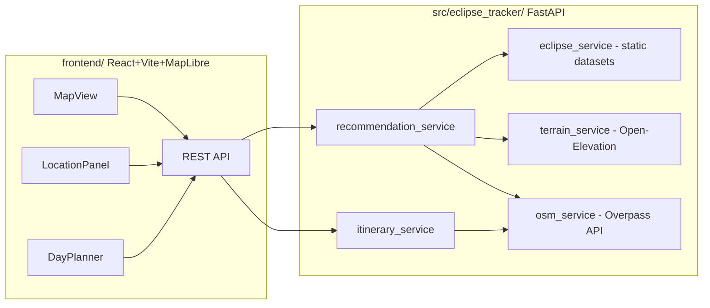

# Eclipse Tracker — build plan + progress

Saved so work can resume after switching accounts/sessions. Original approved plan is also at
`~/.claude/plans/cozy-knitting-nova.md` (may not be visible in a different account).

**All tasks below (4b–9) are now done** (2026-08-04 session). Backend: 48/48 tests passing, lint clean
(`uv run ruff check src` → 0 errors), format clean. Frontend: builds and lints clean
(`npm run build`, `npm run lint`). Justfile has the custom commands section. README rewritten. App was
live-tested end-to-end via a serveo.net tunnel in this session.

**Cleanup needed before next commit**: `src/eclipse_tracker/config/settings.yml` → `cors.allow_origins`
has a temporary serveo.net tunnel URL added for that live test, marked
`# temporary serveo tunnel for live testing, remove after`. Remove that line (keep the `localhost:5173` /
`127.0.0.1:5173` entries). Also `frontend/vite.config.ts` has `allowedHosts: [".serveousercontent.com"]`
added for the same reason — this one is fine to keep (harmless if unused, useful for future ad-hoc tunnel
testing) but flag it to the user in case they'd rather remove it.

**Verified fresh on 2026-08-04** — the status below reflects an actual `pytest` + `ruff` run, not memory.

---

## 1. Goal and locked decisions

Turn a copier-generated FastAPI scaffold into a real app that recommends the best spot to watch the next
total solar eclipse from the user's location, and helps plan the day around it (food, sightseeing, waiting).
Backend API is largely built; the map frontend is not started.

Decisions already made with the user — **do not re-litigate these**:

- **Eclipse data**: bundled static JSON datasets, no live Besselian-element computation. First dataset is the
  real 2026-08-12 total eclipse (Greenland → Iceland → Spain). Adding a future eclipse = drop in a new JSON
  file. Data is **hand-approximated, not authoritative NASA data** — the `source_note` field says so, and the
  README must repeat the disclaimer.
- **Terrain/obstruction**: Open-Elevation (public, keyless) for a horizon profile toward the sun's azimuth,
  plus OSM building footprints (Overpass) as an urban-obstruction proxy.
- **User location**: browser geolocation with manual override/search on the frontend; the backend just takes
  `lat`/`lon`/`range_km`.
- **Frontend**: React + Vite + TypeScript + Tailwind + MapLibre GL, free vector tiles via OpenFreeMap
  (no vendor API key). Premium dark "astro" aesthetic.

## 2. Architecture



---

## 3. Verified current state (run 2026-08-04)

```
uv run pytest tests/small tests/medium -q   →  45 passed, 0 failed
uv run ruff check src                        →  60 errors
```

**The whole test suite is green, including `tests/medium/test_recommendations.py`.** An earlier version of
this plan said that file was "written but not run" — that is stale; it runs and passes. Do not rewrite it.

### Backend — done and working

| Path | What it is |
|---|---|
| `src/eclipse_tracker/data/eclipses/2026-08-12.json` | Bundled centerline dataset (hand-approximated; disclaimer in `source_note`) |
| `src/eclipse_tracker/models.py` | All pydantic models (see §4 for the contract) |
| `services/geo.py` | haversine, bearing, destination point, bbox, polyline projection. Pure, tested |
| `services/cache.py` | Tiny async TTL cache (`TTLCache.get_or_set`) |
| `services/http_retry.py` | Exponential-backoff retry for flaky public APIs (429/5xx) |
| `services/eclipse_service.py` | Load bundled eclipses, `next_eclipse`, `get_eclipse`, `local_circumstances`, `is_in_totality_path`, `EclipseNotFoundError` |
| `services/terrain_service.py` | Open-Elevation horizon clearance (ray-cast toward sun azimuth), cached + retried |
| `services/osm_service.py` | Overpass queries: viewpoints-in-bbox, building density, public-access, POI-near. Cached + retried |
| `services/poi_classify.py` | OSM tags → coarse category |
| `services/scoring_service.py` | Pure weighted composite scorer. Tested |
| `services/recommendation_service.py` | Orchestrates the above into ranked candidates; drops a candidate on `httpx.HTTPError` rather than failing the request |
| `services/itinerary_service.py` | Day-of timeline (arrival → sightseeing → food → eclipse → food) from nearby OSM POIs |
| `dependencies.py` | `@lru_cache` DI singletons `get_osm_service` / `get_terrain_service` — **see the trap in §6** |
| `api/{eclipses,recommendations,itinerary}.py` | Routers, wired in `app.py` with CORS from settings |
| `config/settings.yml` | Added `cors`, `external_apis`, `scoring` sections |

**Pre-existing scaffold bug already fixed**: the template's `logging_setup` logging dependency does not exist on
PyPI — `import logging_setup` failed before any of this work began. Replaced with `logging_setup.py`, a structlog
shim exposing the same `get_logger` / `LogConfig` / `initialize_multiple_loggers` surface; both import sites
now do `from eclipse_tracker import logging_setup`. Added `structlog` + `httpx` to dependencies and
`respx` to the dev group. Do not reintroduce `logging_setup`.

### Tests — done

- `tests/small/`: `test_geo.py`, `test_scoring_service.py`, `test_poi_classify.py`, `test_eclipse_service.py`
- `tests/medium/`: `eclipses.feature` + `test_eclipses.py` (pytest-bdd), `test_recommendations.py`
  (plain pytest + respx, no `.feature` file)

### Not started

Tasks 4b and 5–9 in §7.

---

## 4. API contract (use this instead of re-reading the routers)

All routers are already mounted. Server: `just serve` → `http://localhost:8080`.

| Method | Path | Input | Output |
|---|---|---|---|
| GET | `/api/eclipses` | — | `list[Eclipse]` |
| GET | `/api/eclipses/next` | — | `Eclipse` |
| GET | `/api/eclipses/{eclipse_id}` | path param | `Eclipse`, 404 if unknown |
| POST | `/api/recommendations` | `RecommendationRequest` body | `RecommendationResponse`, 404 on unknown `eclipse_id` |
| GET | `/api/itinerary` | query: `candidate_id`, `candidate_name`, `eclipse_id`, `lat`, `lon` | `ItineraryResponse`, 404 on unknown `eclipse_id` |
| GET | `/alive` | — | 204 |

Note the asymmetry: **recommendations is POST with a JSON body; itinerary is GET with query params.**
`ItineraryRequest` exists in `models.py` but the route takes query params — leave as is unless the frontend
makes a body cleaner, in which case change both sides and say so.

Model shapes (`models.py`):

```
RecommendationRequest: lat, lon, range_km=150 (0<x<=2000), eclipse_id: str|None, limit=20 (1..100),
                       weights: ScoringWeights|None
RecommendationResponse: eclipse: Eclipse, origin: (lat, lon), range_km, candidates: list[Candidate]
Candidate: id, name, lat, lon, category, distance_km, totality_duration_s, eclipse_time_utc,
           sun_azimuth_deg, sun_altitude_deg, horizon_clearance_deg, is_accessible,
           accessibility_note, tags: dict[str,str], score: ScoreBreakdown
ScoreBreakdown: duration, distance, viewing_angle, beauty, accessibility, composite  (all 0..1-ish)
ScoringWeights: duration .30, distance .15, viewing_angle .25, beauty .20, accessibility .10
Eclipse: id, name, date, type, source_note, greatest_duration_s, centerline: list[PathPoint]
PathPoint: lat, lon, time_utc, totality_duration_s, path_width_km, sun_azimuth_deg, sun_altitude_deg
ItineraryResponse: candidate_id, eclipse_id, stops: list[ItineraryStop]
ItineraryStop: kind, name, lat, lon, start_local_hint, note, tags
```

A point known to be on the bundled 2026 centerline, useful for fixtures and manual smoke tests:
**41.9, -4.2** (Spain leg).

---

## 5. Lint: exact current state and the decision to make

`uv run ruff check src` → **60 errors**. Ruff is configured with `select = ["ALL"]` and `line-length = 120`.

```
22  CPY001   missing-copyright-notice
 9  TC001    typing-only-first-party-import
 8  TC003    typing-only-standard-library-import
 6  D401     non-imperative-mood (docstring first word)
 3  D107     undocumented-public-init
 3  E501     line-too-long
 2  I001     unsorted-imports          [auto-fixable]
 2  PLR0917  too-many-positional-arguments
 1  PERF401  manual-list-comprehension
 1  PLR0911  too-many-return-statements
 1  UP043    unnecessary-default-type-args  [auto-fixable]
 1  UP046    non-pep695-generic-class
 1  UP047    non-pep695-generic-function
```

**Important context: `just lint` was already failing before any of this work.** The untouched scaffold files
alone (`app.py`, `config/config.py`) produce 8 errors: 3 × TC003, 2 × CPY001, 2 × I001, 1 × UP043. So "green
lint" was never the starting baseline and 22 of the 60 are a copyright-header rule the template clearly never
intended to enforce.

Recommended resolution (do this unless the user objects):

1. Add `"CPY001"` to the `ignore` list in `pyproject.toml` `[tool.ruff.lint]`, with a short comment. This is a
   project-wide policy call, not a per-file hack — the repo has no copyright headers anywhere by design.
2. Run `just lint --fix` for I001/UP043, then fix the rest by hand:
   - TC001/TC003 → move import into an `if TYPE_CHECKING:` block (most files already have `from __future__
     import annotations`, so this is safe).
   - D401 → reword docstring to imperative mood ("Return …" not "Returns …").
   - D107 → add `__init__` docstrings.
   - E501 → wrap; the known offender is `TerrainService.horizon_clearance_deg`'s signature
     (`terrain_service.py:43`, 124 chars).
   - UP046/UP047 → Python 3.14, so use PEP 695 syntax: `class TTLCache[T]:` and `def f[T](...)` in
     `cache.py` / `http_retry.py`, dropping the `TypeVar`.
   - PLR0917/PLR0911 → either refactor or a targeted `# noqa: PLR0917` with a reason; keyword-only params
     (`*`) is the clean fix for the positional-arg count.
3. Target: `uv run ruff check src` exits 0. `just check` = `format` + `lint`, so run that at the end.

Do not add blanket `# noqa` to whole files, and do not lower `select = ["ALL"]`.

---

## 6. Traps and gotchas (read before writing tests)

1. **DI singletons + a 1-hour TTL cache leak across tests.** `get_osm_service` / `get_terrain_service` are
   `@lru_cache` singletons, and each holds a `TTLCache` with `cache_ttl_s: 3600`. The `client` fixture in
   `tests/conftest.py` is **module-scoped**, and `pytest-randomly` is installed so test order varies run to
   run. A test that populates the cache at some lat/lon can therefore silently satisfy a later test whose
   respx mock never fires. Defend against it in `tests/medium/`:

   ```python
   @pytest.fixture(autouse=True)
   def _clear_service_singletons():
       get_osm_service.cache_clear()
       get_terrain_service.cache_clear()
       yield
       get_osm_service.cache_clear()
       get_terrain_service.cache_clear()
   ```

   Alternatively give each test distinct coordinates. The autouse fixture is the more robust choice.

2. **Overpass mocking is one endpoint, many queries.** Everything POSTs to the same `overpass_url`, so a
   respx `side_effect` must inspect `parse_qs(request.content.decode())["data"][0]` and branch on substrings.
   `test_recommendations.py` already does this — copy the pattern. The routing keys per call site:

   | Service call | Distinguishing substring in the query |
   |---|---|
   | `find_viewpoints_in_bbox` | no `around:` (it's a bbox query) |
   | `building_count_near` | `"building"` |
   | `has_public_access_nearby` | `"access"` |
   | `find_poi_near(FOOD_TAGS)` | `amenity"="restaurant` / `cafe` / `bar` |
   | `find_poi_near(SIGHTSEEING_TAGS)` | `tourism"="attraction` / `museum`, `historic` |

   For the itinerary test, food and sightseeing **both** hit `find_poi_near` with `around:`, so branch on
   `"amenity"` vs `"tourism"` — a naive `"around" in query` check will conflate them.

3. **Elevation is a GET with a `locations` param**: `request.url.params["locations"].split("|")` gives N
   points; return `{"results": [{"elevation": ...} × N]}`.

4. **`find_poi_near` and `find_viewpoints_in_bbox` drop unnamed elements.** Every mocked node needs
   `tags.name` or it vanishes and the assertion fails confusingly.

5. **`itinerary_service._pick` excludes POIs whose name equals `candidate_name`** — give the mocked
   sightseeing POI a different name than the candidate, or the sightseeing stop is silently omitted.

6. **Sandbox has no egress to the public APIs.** `api.open-elevation.com` times out and `overpass-api.de`
   refuses connections in this container (`nominatim.openstreetmap.org` was reachable — got a 302). This is an
   allowlist, not a code bug. Live end-to-end verification of `/api/recommendations` and `/api/itinerary` is
   impossible here; the respx-mocked medium tests are the correctness gate. Mention this to the user rather
   than reporting the endpoints as unverified. A real deployment has normal internet.

7. **Medium-test convention is mixed.** `test_eclipses.py` is pytest-bdd with a `.feature` file (matching the
   scaffold's `dummy.feature` / `get_alive.feature`); `test_recommendations.py` is plain pytest. Pick
   plain-pytest for the itinerary test to match its sibling, and note the inconsistency to the user rather
   than converting files unasked.

8. **Python 3.14**, `requires-python = ">=3.14,<3.15"`. Use modern syntax (PEP 695 generics, `X | None`).

---

## 7. Task list

Mirror in TaskCreate/TaskList if available. Tasks 4b–9 remain.

| # | Task | Status |
|---|---|---|
| 1 | Eclipse dataset + pydantic models | completed |
| 2 | Backend services | completed |
| 3 | Backend API routers + app wiring | completed |
| 4a | Backend tests: small + eclipses + recommendations | completed (45 passing) |
| 4b | `tests/medium/test_itinerary.py` | **start here** |
| 5 | Frontend scaffold | pending |
| 6 | Frontend components | pending |
| 7 | Justfile custom-commands section | pending |
| 8 | README rewrite | pending |
| 9 | Final verification pass | pending |

### 4b — `tests/medium/test_itinerary.py`

Plain pytest + respx, same shape as `test_recommendations.py`. Only Overpass needs mocking (the itinerary
path never touches Open-Elevation). Cover:

- happy path: `GET /api/itinerary?...` at 41.9,-4.2 → 200, `stops` contains an `arrival` stop first, plus a
  `sightseeing` and a `food` stop, all with the mocked names;
- no nearby POIs (Overpass returns `{"elements": []}`) → still 200 with at least the arrival stop, no crash;
- unknown `eclipse_id` → 404.

Add the singleton-clearing fixture from §6.1.

**Done when**: `uv run pytest tests/medium -q` passes, and passes again with `-p no:randomly` and with a
different random seed.

### 5–6 — Frontend

New `frontend/` dir at repo root: Vite + React + TypeScript + Tailwind + MapLibre GL. No vendor keys —
OpenFreeMap style URL (`https://tiles.openfreemap.org/styles/dark`).

Components:

- `MapView` — MapLibre map; draws the eclipse centerline as a GeoJSON LineString from
  `GET /api/eclipses/next`, plus a totality-band polygon derived from each `PathPoint.path_width_km`;
  candidate markers sized/colored by `score.composite`; click a marker → select it.
- `LocationPanel` — selected candidate detail: score breakdown bars, totality duration, local eclipse time,
  sun azimuth/altitude, horizon clearance, accessibility note.
- `Controls` — range slider (`range_km`), "use my location" (browser geolocation), address search via
  Nominatim (respect its usage policy: set a `User-Agent`, debounce, ≤1 req/s).
- `DayPlanner` — calls `/api/itinerary` for the selected candidate, renders the timeline vertically.

Suggested layout: `src/{components,api,hooks,types}`. Generate the TS types by hand from §4 — do not add an
OpenAPI codegen toolchain unless the user asks.

Theme: dark "astro" — deep indigo/violet gradients, glassmorphic panels, subtle motion. Prefer CSS
transitions over an animation library.

CORS is already configured for `localhost:5173` and `127.0.0.1:5173`, so **the dev server must run on 5173**
(Vite's default) or `settings.yml` needs updating too. Point the frontend at `http://localhost:8080` via a
`VITE_API_BASE_URL` env var with that default.

**Done when**: `npm run build` succeeds, and `npm run dev` + `just serve` together render the map with the
centerline and live candidates.

### 7 — Justfile

Append a new section, matching the file's existing style (`# SECTION NAME` + `####…` rule, `*args=""`
passthrough, one-line `#` doc comment above every recipe so `just --list` reads well):

```
# CUSTOM PROJECT COMMANDS
##############################################################################
frontend-install / frontend-dev / frontend-build / frontend-lint / frontend-preview
dev                                  # backend + frontend together
eclipses-list                        # curl helper
recommend lat lon range_km="150"     # curl helper
itinerary candidate_id eclipse_id lat lon   # curl helper
```

Recipes with shell logic use the `#!/usr/bin/env bash` shebang form, as elsewhere in the file.

### 8 — README rewrite

Current README is the untouched template. Rewrite with: what the app does, the mermaid architecture diagram
from §2, quickstart (backend `just setup` → `just serve`; frontend `just frontend-install` →
`just frontend-dev`), a curl example per endpoint with real trimmed output, an explanation of the scoring
algorithm and its weights, the Justfile command reference, and a **prominent limitations/disclaimer section**:
hand-approximated eclipse data (not NASA), public-API rate limits, no live Besselian computation.

### 9 — Final verification

```
just check      # ruff format + ruff check src  → must exit 0
just test       # small + medium                → must be green
just frontend-build
just serve      # then curl each endpoint from §4
```

Then report to the user: what passes, that the external-API paths are verified via mocks only because of the
sandbox egress restriction (§6.6), and any decisions taken (the CPY001 ignore, itinerary GET-vs-POST).

---

## 8. Resuming

1. Read this file. `~/.claude/plans/cozy-knitting-nova.md` if it is visible in this account.
2. `uv run pytest tests/small tests/medium -q` — expect 45 passed. If not, that is a real regression; fix it
   before moving on.
3. Start at task 4b, then 5–6 (frontend), 7 (Justfile), 8 (README), 9 (verify). Lint (§5) can be done any
   time but must be clean before task 9.
