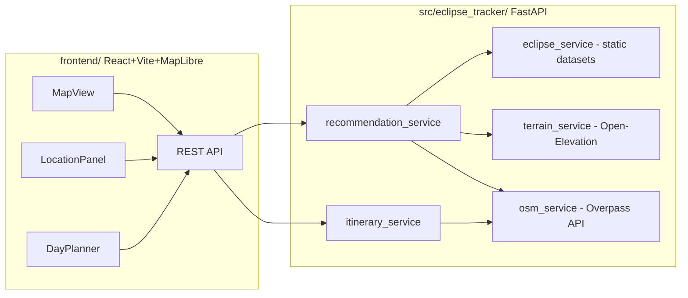

# Eclipse Tracker

Recommends the best nearby spot to watch the next total solar eclipse — ranked by totality duration,
viewing angle, scenery, and accessibility — and builds a simple day-of plan (arrival, food, sightseeing)
around it. FastAPI backend, React + MapLibre frontend.

> [!WARNING]
> **Eclipse path data is hand-approximated, not authoritative.** The bundled centerline for the
> 2026-08-12 eclipse (`src/eclipse_tracker/data/eclipses/2026-08-12.json`) was built from publicly known
> characteristics of the event (path across Greenland, Iceland, and Spain), **not** extracted from NASA
> GSFC Besselian elements or an official shapefile. Every dataset's `source_note` field repeats this.
> **Do not use this app for real eclipse-chasing trip planning** without replacing the bundled data with
> an authoritative source (e.g. NASA GSFC eclipse predictions).
>
> Terrain and points-of-interest come from free public APIs (Open-Elevation, OpenStreetMap Overpass,
> Nominatim) with no API key and no SLA — expect occasional rate-limiting or slow responses, especially
> under repeated/bulk requests.

## Architecture



- **`eclipse_service`** loads bundled eclipse datasets and interpolates local circumstances (time, sun
  azimuth/altitude, totality duration) at an arbitrary lat/lon along the centerline.
- **`terrain_service`** estimates horizon obstruction by ray-casting toward the sun's azimuth and sampling
  ground elevation via Open-Elevation — a 2D-profile proxy, not a full 3D viewshed.
- **`osm_service`** queries OpenStreetMap Overpass for viewpoints, building density (urban-obstruction
  proxy), road/path accessibility, and nearby food/sightseeing POIs.
- **`recommendation_service`** combines all of the above into a ranked, weighted composite score per
  candidate viewing location. Tolerant of individual external-API failures — a candidate that fails to
  enrich (e.g. a terrain lookup times out) is dropped rather than failing the whole request.
- **`itinerary_service`** lays out a simple day-of timeline around a chosen candidate.

## Prerequisites

- [uv](https://docs.astral.sh/uv/) (backend)
- [just](https://github.com/casey/just#installation) (task runner)
- [Node.js](https://nodejs.org/) 20+ and npm (frontend)

## Quickstart

```bash
# Backend
just setup           # creates .venv, installs dependencies
just serve            # http://localhost:8080

# Frontend (separate terminal)
just frontend-install
just frontend-dev     # http://localhost:5173

# Or both together:
just dev
```

The frontend expects the backend at `http://localhost:8080` by default. Override with
`frontend/.env`:

```bash
cp frontend/.env.example frontend/.env
# edit VITE_API_BASE_URL if your backend runs elsewhere
```

CORS on the backend is preconfigured for `localhost:5173` / `127.0.0.1:5173` (`config/settings.yml` →
`cors.allow_origins`) — if you change the frontend's dev port, update that too. Note that
`uvicorn --reload` only watches `.py` files, so editing `settings.yml` needs a server restart.

### Hosted builds (GitHub Pages)

The frontend is deployed to <https://greg0109.github.io/eclipse-tracker/> by
`.github/workflows/pages.yml`. GitHub Pages serves static files only, so **that build has no backend
of its own**:

- the map and the totality path still render — the eclipse dataset is bundled into the page;
- ranking viewing spots and building a day plan need the API.

`http://localhost:8080` is deliberately *not* assumed when the page is served from a remote host: that
address is the visitor's machine, not yours, so it can only ever work for whoever is running the
backend locally, and browsers increasingly block such requests (Firefox reports "Local Network Access
detected"). The page says so and offers a button to opt in when you *are* running one locally.

To make a hosted build fully functional, deploy the backend somewhere reachable over HTTPS, add its
origin to `cors.allow_origins`, and set a `VITE_API_BASE_URL` repository variable — the workflow
passes it through at build time, no code change needed.

## API reference

| Method | Path | Body / query | Response |
|---|---|---|---|
| `GET` | `/api/eclipses` | — | `Eclipse[]` |
| `GET` | `/api/eclipses/next` | — | `Eclipse` |
| `GET` | `/api/eclipses/{eclipse_id}` | — | `Eclipse`, 404 if unknown |
| `POST` | `/api/recommendations` | `{lat, lon, range_km?, eclipse_id?, limit?, weights?}` | `RecommendationResponse` |
| `GET` | `/api/itinerary` | `?candidate_id&candidate_name&eclipse_id&lat&lon` | `ItineraryResponse`, 404 if `eclipse_id` unknown |
| `GET` | `/alive` | — | 204 |

### List bundled eclipses

```bash
just eclipses-list
# or: curl -s http://localhost:8080/api/eclipses | python3 -m json.tool
```

```json
{
  "id": "2026-08-12",
  "name": "Total Solar Eclipse of August 12, 2026",
  "date": "2026-08-12",
  "type": "total",
  "source_note": "Centerline samples in this file are HAND-APPROXIMATED ... [see disclaimer above]",
  "greatest_duration_s": 138.0,
  "centerline": [
    { "lat": 78.5, "lon": -55.0, "time_utc": "2026-08-12T16:56:00Z", "totality_duration_s": 118.0,
      "path_width_km": 230.0, "sun_azimuth_deg": 305.0, "sun_altitude_deg": 24.0 },
    ...
  ]
}
```

Unknown id:

```bash
curl -s http://localhost:8080/api/eclipses/nope
# {"detail":"Unknown eclipse id: nope"}   (404)
```

### Get ranked viewing recommendations

```bash
just recommend 41.9 -4.2 150
```

```json
{
  "eclipse": { "id": "2026-08-12", "...": "..." },
  "origin": [41.9, -4.2],
  "range_km": 100,
  "candidates": [
    {
      "id": "way/123456",
      "name": "Mirador del Eclipse",
      "lat": 41.92, "lon": -4.18,
      "category": "viewpoint",
      "distance_km": 3.1,
      "totality_duration_s": 67.4,
      "eclipse_time_utc": "2026-08-12T18:30:11Z",
      "sun_azimuth_deg": 270.2, "sun_altitude_deg": 6.1,
      "horizon_clearance_deg": 4.8,
      "is_accessible": true,
      "accessibility_note": "Public road/path within 300 m",
      "tags": { "tourism": "viewpoint" },
      "score": { "duration": 0.49, "distance": 0.97, "viewing_angle": 0.71, "beauty": 0.6,
                 "accessibility": 1.0, "composite": 68 }
    }
  ]
}
```

### Get a day-of itinerary for a chosen candidate

```bash
just itinerary way/123456 "Mirador del Eclipse" 2026-08-12 41.92 -4.18
```

```json
{
  "candidate_id": "way/123456",
  "eclipse_id": "2026-08-12",
  "stops": [
    { "kind": "arrival", "name": "Mirador del Eclipse", "start_local_hint": "16:30 UTC",
      "note": "Arrive early to secure parking/space - popular viewing spots fill up before totality." },
    { "kind": "sightseeing", "name": "Museo del Eclipse", "start_local_hint": "14:30 UTC", "...": "..." },
    { "kind": "food", "name": "Restaurante Sol", "start_local_hint": "17:00 UTC", "...": "..." },
    { "kind": "eclipse", "name": "Mirador del Eclipse", "start_local_hint": "18:30 UTC",
      "note": "Totality: ~67s, sun altitude 6 deg." }
  ]
}
```

## Scoring algorithm

Each candidate gets five 0–1 sub-scores, combined into a 0–100 composite via a weighted sum
(`config/settings.yml` → `scoring.weights`, overridable per-request via `weights` in the recommendation
body):

| Sub-score | Default weight | What it measures |
|---|---|---|
| `duration` | 0.30 | Totality length at that point, relative to the eclipse's greatest duration |
| `viewing_angle` | 0.25 | How much horizon clearance the sun has above local terrain (from `terrain_service`) |
| `beauty` | 0.20 | Coarse category bonus (viewpoint/peak/beach score higher than a generic POI) |
| `distance` | 0.15 | Closer to the request origin scores higher, within `range_km` |
| `accessibility` | 0.10 | Whether a public road/path reaches the point (`osm_service`) |

## Justfile reference

Backend (from the base template): `just setup`, `just serve`, `just test`, `just lint [--fix]`,
`just check`, `just coverage`, `just docs`, `just docker-build`. Run `just --list` for the full set.

Project-specific additions:

| Command | Does |
|---|---|
| `just frontend-install` | `npm install` in `frontend/` |
| `just frontend-dev` | Vite dev server on :5173 |
| `just frontend-build` | Production build to `frontend/dist` |
| `just frontend-lint` | `oxlint` over `frontend/src` |
| `just frontend-preview` | Preview the production build |
| `just dev` | Backend (`just serve`) + frontend dev server together |
| `just eclipses-list` | `GET /api/eclipses`, pretty-printed |
| `just recommend <lat> <lon> [range_km=100]` | `POST /api/recommendations`, pretty-printed |
| `just itinerary <candidate_id> <candidate_name> <eclipse_id> <lat> <lon>` | `GET /api/itinerary`, pretty-printed |

All three curl helpers target `http://localhost:8080` by default; override with `API_HOST=<url>`.

## Limitations

- **Eclipse data is hand-approximated** (see disclaimer above) — not suitable for real trip planning.
- **No live Besselian-element computation.** Adding a future eclipse means dropping in a new hand-built
  JSON file under `src/eclipse_tracker/data/eclipses/`, not computing one.
- **Public, keyless third-party APIs** (Open-Elevation, Overpass, Nominatim) have no uptime guarantee and
  modest rate limits. The backend retries transient failures and caches results for an hour
  (`external_apis.cache_ttl_s`), but sustained heavy use may still get throttled.
- **Terrain obstruction is a 2D ray-cast proxy** along the sun's azimuth, not a full 3D viewshed, and does
  not model vegetation.
